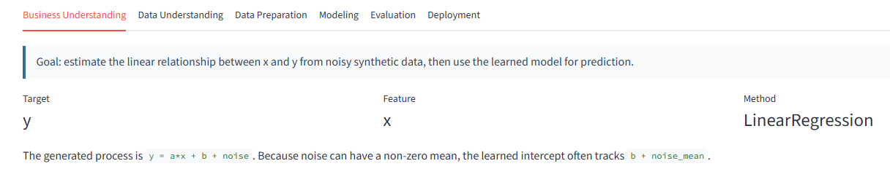
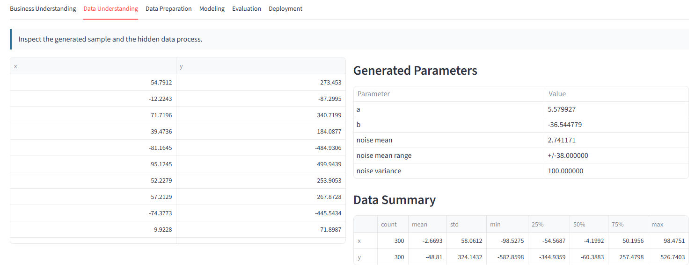
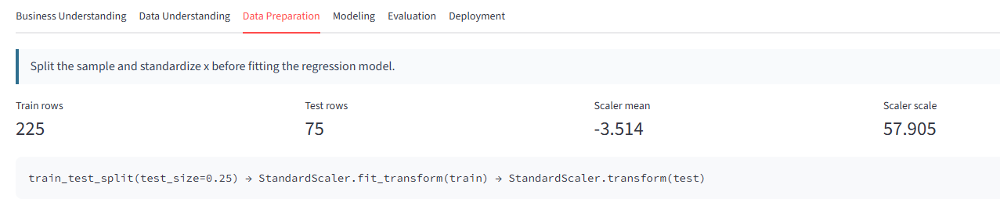
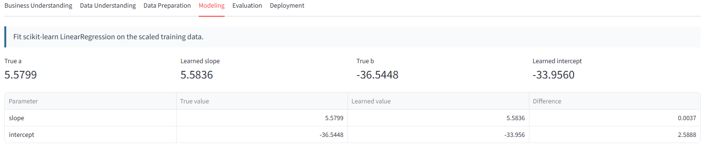
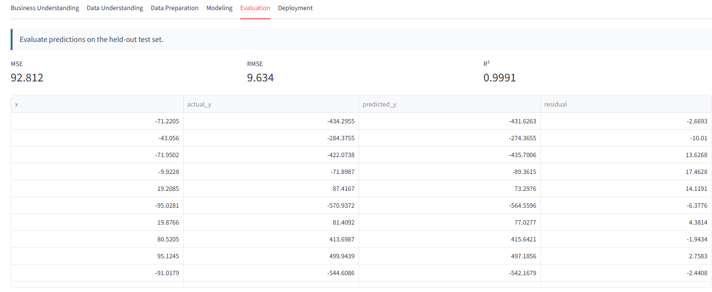
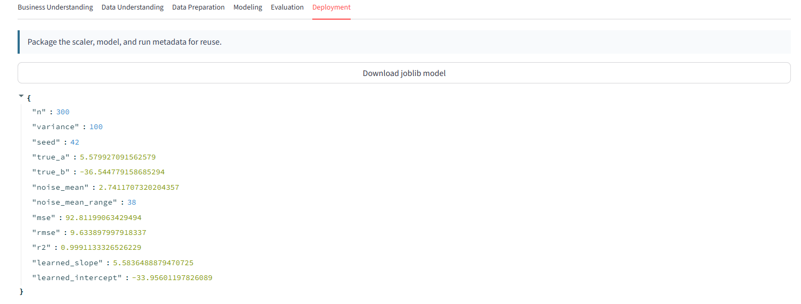

# CRISP-DM Regression Explorer 專案報告

## 摘要

本專案建立一個單檔 Streamlit 應用程式 `app.py`，用於示範 CRISP-DM 方法論在簡單線性回歸問題中的完整流程。應用程式會產生符合指定分布的合成資料，透過 scikit-learn 完成資料切分、標準化、線性迴歸建模與模型評估，並提供互動式視覺化、參數比較、單點預測與 joblib 模型匯出功能。

專案主要目的是讓使用者能用互動方式理解資料生成、模型訓練、模型評估與部署封裝之間的關係，並把 CRISP-DM 的六個階段具體落實在可執行的機器學習應用中。

## 專案目標

本專案的目標如下：

1. 建立一個可直接執行的 Streamlit 網頁應用。
2. 使用 scikit-learn 示範線性回歸模型訓練流程。
3. 以 CRISP-DM 六階段組織應用內容。
4. 使用合成資料讓使用者可控制樣本數、噪音變異數與隨機種子。
5. 顯示真實資料生成參數與模型學習參數之差異。
6. 提供 MSE、RMSE、R² 等模型評估指標。
7. 提供輸入 `x` 後即時預測 `y` 的功能。
8. 使用 joblib 封裝並下載模型，支援後續部署或重複使用。
9. 支援 Streamlit Community Cloud 等 streamlit.app 部署環境。

## 專案檔案

目前專案主要包含以下檔案：

| 檔案 | 說明 |
| --- | --- |
| `app.py` | Streamlit 主應用程式，包含資料生成、建模、評估、視覺化與模型匯出 |
| `requirements.txt` | 部署與執行所需 Python 套件 |
| `start_app.bat` | Windows 啟動腳本，會另開終端機執行 Streamlit |
| `chat.md` | 對話與操作紀錄 |
| `report.md` | 本專案報告 |

## 使用技術

本專案使用的主要技術如下：

| 類別 | 技術 |
| --- | --- |
| 前端與互動介面 | Streamlit |
| 資料處理 | NumPy、Pandas |
| 機器學習 | scikit-learn |
| 視覺化 | Matplotlib |
| 模型儲存 | joblib |
| 執行環境 | Python |
| 部署支援 | streamlit.app / Streamlit Community Cloud |

## 資料生成設計

應用程式使用合成資料建立線性回歸任務。資料生成公式為：

```text
y = a*x + b + noise
```

其中各變數定義如下：

| 變數 | 分布或範圍 | 說明 |
| --- | --- | --- |
| `n` | `[100, 1000]` | 資料筆數，由 sidebar 滑桿控制 |
| `x` | `Uniform(-100, 100)` | 自變數 |
| `a` | `Uniform(-10, 10)` | 真實斜率 |
| `b` | `Uniform(-50, 50)` | 真實截距 |
| `noise_mean` | `Uniform(-10, 10)` | 噪音平均值 |
| `variance` | `[0, 1000]` | 噪音變異數，由 sidebar 滑桿控制 |
| `noise` | `Normal(noise_mean, variance)` | 常態分布噪音 |
| `y` | `a*x + b + noise` | 目標變數 |

使用者可透過 sidebar 控制：

- `n`：樣本數。
- `variance`：噪音變異數。
- `seed`：隨機種子。
- `Generate Data`：根據目前參數重新產生資料。

隨機種子可確保相同設定下能產生可重現的資料，方便比較不同模型結果。

## CRISP-DM 流程設計

本專案依照 CRISP-DM 的六個階段安排 Streamlit 分頁，讓機器學習流程具有清楚的學習結構。

### 1. Business Understanding

此階段定義問題目標：

- 目標是估計 `x` 與 `y` 之間的線性關係。
- 使用者希望透過模型學到接近真實斜率 `a` 與截距 `b` 的參數。
- 建立後的模型可用於輸入新 `x` 值並預測 `y`。

在此專案中，商業問題被簡化為一個可控的教學情境：給定帶有噪音的線性資料，觀察線性回歸是否能有效恢復資料背後的趨勢。

### 2. Data Understanding

此階段用於檢視資料與資料生成過程。

應用程式提供：

- 前 20 筆資料表格。
- 真實生成參數表格，包括 `a`、`b`、`noise_mean`、`variance`。
- `x` 與 `y` 的描述統計，例如平均值、標準差、最小值、最大值與分位數。
- 主畫面 scatter plot，讓使用者直觀看到資料分布與噪音程度。

此階段幫助使用者理解噪音變異數、樣本數與資料分散程度之間的關係。

### 3. Data Preparation

此階段處理模型訓練前的資料準備。

目前流程包含：

```text
train_test_split(test_size=0.25)
StandardScaler.fit_transform(train)
StandardScaler.transform(test)
```

資料準備重點如下：

- 將資料切分為訓練集與測試集。
- 使用 75% 資料訓練模型。
- 使用 25% 資料評估模型。
- 使用 `StandardScaler` 對 `x` 進行標準化。
- scaler 只在訓練集上 fit，再套用到測試集，避免資料洩漏。

雖然線性回歸在單一特徵情境下不一定需要標準化，但本專案加入 `StandardScaler` 是為了示範典型的機器學習前處理流程。

### 4. Modeling

此階段使用 scikit-learn 的 `LinearRegression` 建立模型。

建模流程如下：

1. 取出 `x` 作為特徵矩陣。
2. 取出 `y` 作為目標變數。
3. 切分訓練集與測試集。
4. 對訓練集特徵做標準化。
5. 使用標準化後的訓練資料訓練線性回歸模型。
6. 將模型係數轉回原始 `x` 尺度，方便與真實參數比較。

由於模型是在標準化後的 `x` 上訓練，因此模型內部係數不是原始尺度下的斜率。程式會透過以下轉換取得原始尺度的學習斜率與截距：

```text
learned_slope = scaled_coefficient / scaler.scale_
learned_intercept = model_intercept - learned_slope * scaler.mean_
```

這樣使用者可以直接比較：

- 真實斜率 `a` vs 學習斜率。
- 真實截距 `b` vs 學習截距。

需要注意的是，因為噪音平均值 `noise_mean` 不一定為 0，所以模型學習到的截距通常會接近 `b + noise_mean`，而不一定只接近 `b`。

### 5. Evaluation

此階段使用測試集評估模型預測效果。

應用程式提供三個主要指標：

| 指標 | 說明 |
| --- | --- |
| MSE | Mean Squared Error，平均平方誤差 |
| RMSE | Root Mean Squared Error，平均平方誤差平方根 |
| R² | 決定係數，表示模型解釋目標變異的程度 |

指標解讀如下：

- MSE 越低，代表平均平方誤差越小。
- RMSE 與 `y` 使用相同尺度，因此較容易理解誤差大小。
- R² 越接近 1，代表模型對資料趨勢的解釋能力越好。
- 當 variance 增加時，噪音變大，MSE 與 RMSE 通常會上升，R² 可能下降。
- 當 n 增加時，模型估計通常更穩定，但若噪音很大，評估結果仍可能波動。

應用程式也顯示測試集預測結果與 residual，方便觀察單筆預測誤差。

### 6. Deployment

此階段示範如何將模型封裝以供後續使用。

應用程式使用 joblib 將以下內容包成可下載檔案：

- `scaler`
- `model`
- `metadata`

metadata 包含：

- 樣本數 `n`
- 噪音變異數 `variance`
- 隨機種子 `seed`
- 真實斜率與截距
- 噪音平均值
- MSE、RMSE、R²
- 學習到的斜率與截距

下載檔名為：

```text
crispdm_linear_regression.joblib
```

這樣的封裝方式保留了完整推論所需資訊。因為模型訓練時使用了標準化，所以部署時不能只保存 `LinearRegression`，也必須保存對應的 `StandardScaler`。

## 使用者介面設計

本專案的 UI 採用 Streamlit wide layout，主要分為 sidebar、主視覺區與六個流程分頁。

### Sidebar

Sidebar 提供資料生成控制項：

- `n` slider：控制資料筆數。
- `Variance` slider：控制噪音變異數。
- `Seed` slider：控制隨機種子。
- `Generate Data` button：套用目前設定並重新生成資料。

此設計讓使用者可以明確控制何時重新產生資料，避免每次調整 slider 時資料自動變動。

### 主畫面

主畫面上半部包含：

- scatter plot。
- regression line。
- 目前資料筆數、variance、seed。
- MSE、RMSE、R²。
- 單點 `x` 輸入與預測結果。

此區域提供模型結果的快速總覽，讓使用者不必切換分頁也能看到最重要的資訊。

### 分頁區

分頁區對應 CRISP-DM 六個階段：

1. Business Understanding
2. Data Understanding
3. Data Preparation
4. Modeling
5. Evaluation
6. Deployment

這種設計讓學習者能按照資料科學流程循序理解專案，而不是只看到模型訓練結果。

## 快取與效能設計

本專案使用 Streamlit cache 改善互動效能。

### `st.cache_data`

用於快取資料與可重新計算的結果：

- `generate_data`
- `make_regression_line`

這些函式輸入固定時，輸出也固定，適合使用 `st.cache_data`。

### `st.cache_resource`

用於快取模型訓練結果：

- `fit_model`

模型與 scaler 屬於較重的資源物件，使用 `st.cache_resource` 可避免在相同資料與 seed 下重複訓練。

## 啟動方式

### 使用命令列啟動

在專案資料夾執行：

```bat
python -m streamlit run app.py --server.port 8501
```

啟動後開啟：

```text
http://localhost:8501
```

### 使用批次檔啟動

也可以直接雙擊：

```text
start_app.bat
```

該批次檔內容會：

1. 切換到專案所在資料夾。
2. 另開一個命令提示字元視窗。
3. 執行 Streamlit 應用。
4. 保留終端機視窗以查看 log。

## 部署方式

若部署到 Streamlit Community Cloud，可使用以下檔案：

- `app.py`
- `requirements.txt`

部署步驟概念如下：

1. 將專案推送到 GitHub repository。
2. 在 Streamlit Community Cloud 建立新 app。
3. 指定主檔案為 `app.py`。
4. Streamlit 會根據 `requirements.txt` 安裝依賴。
5. 部署完成後即可透過公開網址使用。

`requirements.txt` 包含：

```text
streamlit
scikit-learn
pandas
numpy
matplotlib
joblib
```

## 操作流程

使用者可依照以下流程操作：

1. 啟動應用程式。
2. 在 sidebar 選擇資料筆數 `n`。
3. 調整噪音變異數 `variance`。
4. 選擇隨機種子 `seed`。
5. 按下 `Generate Data` 產生資料。
6. 在主畫面觀察 scatter plot 與 regression line。
7. 查看 MSE、RMSE、R²。
8. 切換六個 CRISP-DM 分頁查看詳細流程。
9. 在 `Predict y for x` 輸入新 `x` 值並查看預測。
10. 到 Deployment 分頁下載 joblib 模型。

## 模型與結果解讀

本專案使用簡單線性回歸，因此模型假設 `x` 與 `y` 之間存在線性關係。由於資料生成過程本身就是線性模型加上常態噪音，因此在噪音適中且資料量足夠時，`LinearRegression` 通常可以學到接近真實斜率的參數。

不過，結果會受到以下因素影響：

- 噪音變異數越高，資料點越分散。
- 噪音平均值不為 0 時，截距估計會受到偏移。
- 樣本數越少，估計結果越容易波動。
- train/test split 會因 seed 不同而影響評估結果。

因此，本專案除了提供模型結果，也提供真實參數對照，讓使用者能看到資料生成機制與模型學習結果之間的差異。

## 專案限制

本專案主要作為 CRISP-DM 與線性回歸的教學示範，因此有以下限制：

1. 只使用單一特徵 `x`。
2. 只示範線性回歸，未比較其他模型。
3. 資料為合成資料，不代表真實業務資料。
4. 未加入資料缺失、離群值或類別變數處理。
5. 未提供模型版本管理或正式 API 部署。
6. 未加入自動化測試。

## 未來改進方向

後續可擴充方向包括：

1. 加入多元線性回歸，支援多個特徵。
2. 加入 polynomial features，示範非線性關係。
3. 加入 Ridge、Lasso 等正則化模型比較。
4. 加入 residual plot 與誤差分布圖。
5. 加入資料下載功能。
6. 加入模型上傳與重新載入功能。
7. 加入更完整的部署範例，例如 FastAPI 推論服務。
8. 加入測試檔，驗證資料生成、模型訓練與模型匯出流程。

## 結論

CRISP-DM Regression Explorer 將 CRISP-DM 六階段流程轉換為一個可互動操作的 Streamlit 應用。使用者可以透過滑桿控制資料生成條件，觀察噪音與樣本數如何影響線性回歸模型，並透過圖表、評估指標與參數比較理解模型表現。

本專案雖然規模小，但涵蓋了機器學習專案常見的核心步驟：問題定義、資料理解、資料準備、模型訓練、模型評估與部署封裝。它適合作為資料科學入門教學、課堂展示或 Streamlit 應用開發範例。

## 截圖預留位置

你可以將截圖檔放在 `screenshots/` 資料夾，並依照下面建議檔名儲存；也可以直接在各小節下方貼上圖片。若圖片尚未建立，GitHub/Markdown 預覽會先顯示為缺圖，等截圖放入後就會正常顯示。

### 1. 應用首頁總覽

建議截圖內容：主畫面、scatter plot、regression line、Current Run 指標與預測輸入框。


### 2. Sidebar 資料生成設定

建議截圖內容：`n`、`Variance`、`Seed` 滑桿與 `Generate Data` 按鈕。


### 3. Business Understanding 分頁

建議截圖內容：目標、特徵、方法與問題定義說明。



### 4. Data Understanding 分頁

建議截圖內容：資料前幾筆、真實生成參數與資料描述統計。



### 5. Data Preparation 分頁

建議截圖內容：train/test split 筆數、scaler mean、scaler scale 與前處理流程。



### 6. Modeling 分頁

建議截圖內容：真實參數與學習參數比較表。



### 7. Evaluation 分頁

建議截圖內容：MSE、RMSE、R² 與 residual 表格。



### 8. Deployment 分頁

建議截圖內容：joblib 模型下載按鈕與 metadata。


