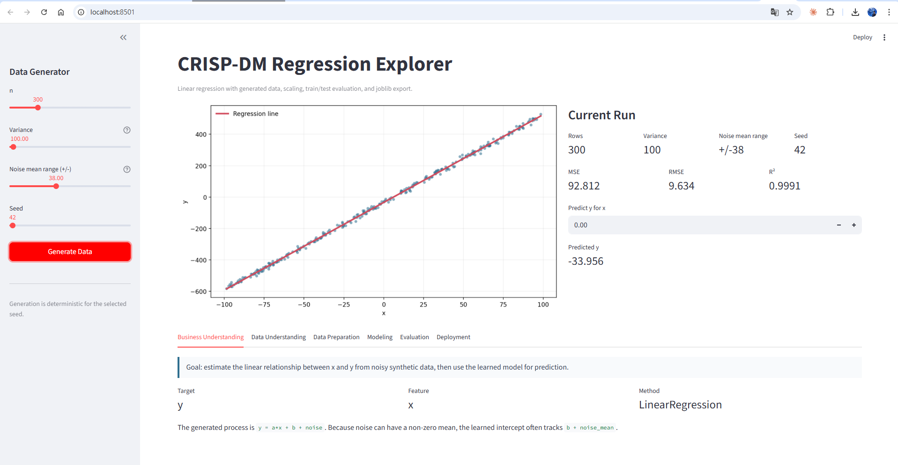
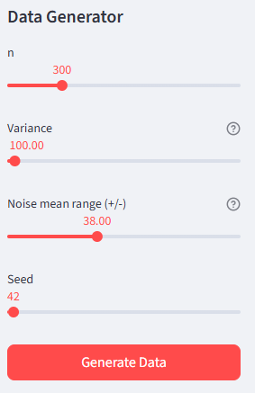

# Chat Log

## 2026-04-28

### User

```text
建立單一檔案的 Streamlit（app.py）應用，使用 scikit-learn 示範 CRISP-DM 流程下的線性回歸，UI需包含六個階段（Business Understanding、Data Understanding、Data Preparation、Modeling、Evaluation、Deployment）。

生成資料：
n∈[100,1000]，x~Uniform(-100,100)，a~Uniform(-10,10)，b~Uniform(-50,50)，noise~Normal(mean∈[-10,10], var∈[0,1000])，y=ax+b+noise。

Sidebar：n、variance、seed 滑桿 +「Generate Data」按鈕。

流程：train_test_split、StandardScaler、LinearRegression。
評估：MSE、RMSE、R²。

功能：

繪製 scatter + regression line
顯示真實 vs 學習參數
輸入 x 做預測
使用 joblib 儲存模型

要求：輸出乾淨可執行程式碼，優化 layout 與 caching，支援 streamlit.app 部署。
```

### Assistant

先檢查目前資料夾，確認沒有既有檔案或專案結構後，建立單一 `app.py`。設計方向是將 UI 做成六個 CRISP-DM 階段分頁，並使用 cache 優化資料生成、訓練與圖表。

執行過程摘要：

- 使用 PowerShell 檢查專案資料夾。
- 發現 PowerShell profile 被執行政策阻擋，但不影響專案；改用不載入 profile 的方式繼續。
- 新增 `app.py`。
- 將「Generate Data」設計成固定目前 sidebar 參數的動作，避免調整滑桿時資料集自動改變。
- 使用 `joblib` 產生可下載的 `.joblib` 模型封裝，方便 Streamlit Community Cloud 部署與使用。
- 執行 `python -m py_compile app.py`，語法檢查通過。
- 檢查套件時發現本機缺少 `scikit-learn`。
- 補上 `requirements.txt`，方便部署環境自動安裝依賴。
- 執行 `python -m pip install -r requirements.txt` 安裝缺少依賴。
- 啟動 Streamlit 本機服務並確認 HTTP 回應成功。
- 發現新版 Streamlit 提醒 `use_container_width` 已進入淘汰路徑，改為 `width="stretch"`。
- 再次執行語法檢查與 import smoke test，均通過。

完成內容：

- `app.py`：單檔 Streamlit CRISP-DM 線性回歸示範。
- `requirements.txt`：支援 streamlit.app 部署安裝依賴。

功能包含：

- 六個 CRISP-DM 階段：
  - Business Understanding
  - Data Understanding
  - Data Preparation
  - Modeling
  - Evaluation
  - Deployment
- Sidebar：
  - `n` 滑桿
  - `variance` 滑桿
  - `seed` 滑桿
  - `Generate Data` 按鈕
- 資料生成：
  - `n ∈ [100,1000]`
  - `x ~ Uniform(-100,100)`
  - `a ~ Uniform(-10,10)`
  - `b ~ Uniform(-50,50)`
  - `noise ~ Normal(mean ∈ [-10,10], variance ∈ [0,1000])`
  - `y = a*x + b + noise`
- Modeling pipeline：
  - `train_test_split`
  - `StandardScaler`
  - `LinearRegression`
- Evaluation：
  - MSE
  - RMSE
  - R²
- 視覺化：
  - scatter plot
  - regression line
- 互動功能：
  - 顯示真實參數 vs 學習參數
  - 輸入 `x` 預測 `y`
  - 使用 `joblib` 下載模型封裝

最後回覆：

```text
完成了。已建立：

- app.py：單檔 Streamlit CRISP-DM 線性回歸示範
- requirements.txt：支援 streamlit.app 部署安裝依賴

已包含六個 CRISP-DM 階段、資料生成 sidebar、train_test_split、StandardScaler、LinearRegression、MSE/RMSE/R²、scatter + regression line、真實 vs 學習參數、x 預測，以及 joblib 模型下載。

驗證完成：
- python -m py_compile app.py
- python -c "import app"
- Streamlit 本機服務已啟動並回應：http://localhost:8501
```

### User

```text
整理所有對話紀錄到chat.md
```

### Assistant

建立此 `chat.md`，整理目前可見對話內容與執行摘要。

### User

```text
幫我啟動網頁
```

### Assistant

協助啟動 Streamlit 網頁。

執行過程摘要：

- 先檢查 `8501` port 是否已有服務。
- 檢查目前是否已有 Python/Streamlit 程序。
- 發現沒有偵測到 `8501` 上的服務。
- 使用 `Start-Process` 啟動：

```bat
python -m streamlit run app.py --server.headless true --server.port 8501
```

- 將 stdout/stderr 分別寫入：
  - `streamlit.out.log`
  - `streamlit.err.log`
- 使用 `Invoke-WebRequest http://localhost:8501` 做 smoke test。
- 確認 HTTP 狀態碼為 `200`。
- 確認 `8501` port 正在 listen。

最後回覆：

```text
已啟動，網頁可以開這個網址：

http://localhost:8501

目前服務在 port `8501` 正常回應。
```

### User

```text
幫我寫一個 bat 啟動網頁的腳本 會另開一個終端機執行
```

### Assistant

新增 `start_app.bat`，讓使用者雙擊後可另開一個終端機執行 Streamlit 應用。

新增檔案內容：

```bat
@echo off
setlocal

cd /d "%~dp0"

start "CRISP-DM Regression Explorer" cmd /k "python -m streamlit run app.py --server.port 8501"

endlocal
```

執行過程摘要：

- 建立 `start_app.bat`。
- 腳本會切換到 `.bat` 所在目錄。
- 使用 `start` 另開新的 `cmd` 視窗。
- 在新視窗中執行 `python -m streamlit run app.py --server.port 8501`。
- 使用 `cmd /k` 保留終端機視窗，方便查看 Streamlit log。
- 讀取檔案內容確認建立成功。

最後回覆：

```text
已建立 start_app.bat。

雙擊它會另開一個終端機，切到目前專案資料夾，並執行：

python -m streamlit run app.py --server.port 8501

啟動後瀏覽器可開 `http://localhost:8501`。
```

### User

```text
一樣 所有的對話包含後續對話都要幫我新增到 chat.md
```

### Assistant

收到。後續對話也會持續追加到 `chat.md`。本次更新已將「啟動網頁」、「建立 bat 啟動腳本」以及此要求整理進本檔案。

### User

```text
停下現在的網頁程序 讓我可以自己跑
```

### Assistant

協助停止目前正在執行的 Streamlit 網頁程序。

執行過程摘要：

- 檢查 `8501` port 的連線與監聽狀態。
- 找到正在執行的 Streamlit 程序：

```text
PID 19192
"C:\Python314\python.exe" -m streamlit run app.py --server.headless true --server.port 8501
```

- 執行：

```powershell
Stop-Process -Id 19192 -Force
```

- 再次檢查 `8501` port，確認已沒有監聽中的程序。

最後回覆重點：

```text
8501 已經沒有偵測到監聽中的程序，可以自行重新啟動。
```

### User

```text
對於這個專案 幫我寫完整的report.md
```

### Assistant

協助撰寫本專案的完整 `report.md`。

執行過程摘要：

- 讀取目前專案的 `app.py`，確認 Streamlit 應用內容。
- 讀取既有 `chat.md` 的後段內容，理解目前專案操作紀錄。
- 檢查使用者 IDE 中開啟的 `design.md` 與 `proposal.md`。
- 判斷 `design.md` 與 `proposal.md` 內容屬於另一個硬體/Godot 桌寵專案，與目前 Streamlit 線性回歸專案不一致，因此未納入本報告依據。
- 以目前專案檔案 `app.py`、`requirements.txt`、`start_app.bat` 為主，新增 `report.md`。

`report.md` 內容包含：

- 專案摘要。
- 專案目標。
- 專案檔案說明。
- 使用技術。
- 資料生成設計。
- CRISP-DM 六階段說明：
  - Business Understanding
  - Data Understanding
  - Data Preparation
  - Modeling
  - Evaluation
  - Deployment
- Streamlit UI 設計。
- caching 與效能設計。
- 啟動方式。
- streamlit.app 部署方式。
- 操作流程。
- 模型與結果解讀。
- 專案限制。
- 未來改進方向。
- 結論。

新增檔案：

```text
report.md
```

### User

```text
我改成 README 了，然後幫我新增一些圖片預留位置，讓我可以截圖貼上
```

### Assistant

協助在 `README.md` 中新增截圖預留位置，方便後續將應用程式畫面截圖貼上或放入圖片檔。

執行過程摘要：

- 檢查目前專案檔案，確認 `README.md` 已存在。
- 讀取 `README.md` 前後段內容，確認其內容為原本專案報告。
- 在 `README.md` 後方新增「截圖預留位置」章節。
- 新增 `screenshots/` 目錄，並放入 `.gitkeep`，方便保存截圖資料夾。

新增的截圖預留項目包含：

- 應用首頁總覽。
- Sidebar 資料生成設定。
- Business Understanding 分頁。
- Data Understanding 分頁。
- Data Preparation 分頁。
- Modeling 分頁。
- Evaluation 分頁。
- Deployment 分頁。

建議圖片路徑：

```text
screenshots/01-home-overview.png
screenshots/02-sidebar-generator.png
screenshots/03-business-understanding.png
screenshots/04-data-understanding.png
screenshots/05-data-preparation.png
screenshots/06-modeling.png
screenshots/07-evaluation.png
screenshots/08-deployment.png
```

### User

```text
我想要noise random範圍也可以調，現在太集中在線上了
```

### Assistant

協助修改 `app.py`，讓噪音相關參數可以在 sidebar 中更自由調整，避免資料點太集中在回歸線附近。

修改內容：

- `DataSpec` 新增 `noise_mean_range`。
- `generate_data` 新增 `noise_mean_range` 參數。
- 原本固定的 `noise_mean ~ Uniform(-10, 10)` 改為：

```text
noise_mean ~ Uniform(-noise_mean_range, noise_mean_range)
```

- Sidebar 新增：

```text
Noise mean range (+/-)
```

- `Variance` slider 上限由 `1000` 提高到 `10000`，讓資料點可以散得更明顯。
- Current Run 指標新增 `Noise mean range`。
- Data Understanding 的 generated parameters 表格新增 `noise mean range`。
- Deployment metadata 新增 `noise_mean_range`。
- 保留舊 session 相容處理，若舊的 `DataSpec` 沒有 `noise_mean_range`，會自動補上預設值 `10.0`。

驗證：

```text
python -m py_compile app.py
```

結果：通過。

### User

```text
幫我整理 image到一個資料夾
```

### Assistant

協助整理專案中的圖片檔案。

執行過程摘要：

- 掃描專案資料夾中的圖片檔。
- 找到以下圖片位於專案根目錄：

```text
image.png
image-1.png
image-2.png
image-3.png
image-4.png
image-5.png
image-6.png
image-7.png
```

- 將所有圖片移動到既有的 `screenshots/` 資料夾。
- 更新 `README.md` 中原本指向根目錄圖片的連結。

README 圖片連結由：

```text


...
```

改為：

```text


...
```

整理後圖片位置：

```text
screenshots/image.png
screenshots/image-1.png
screenshots/image-2.png
screenshots/image-3.png
screenshots/image-4.png
screenshots/image-5.png
screenshots/image-6.png
screenshots/image-7.png
```

驗證：

- 專案根目錄已沒有 `image*.png`。
- `screenshots/` 內包含所有圖片。
- `README.md` 圖片引用已改為 `screenshots/...`。

### User

```text
然後推到 https://github.com/Williecraft/AIoT-DIC-Regression_Explorer.git
```

### Assistant

協助將目前專案推送到指定 GitHub repository。

執行過程摘要：

- 檢查目前資料夾是否為 git repository。
- 發現尚未初始化 git。
- 新增 `.gitignore`，排除：
  - `__pycache__/`
  - Python bytecode
  - 虛擬環境資料夾
  - Streamlit secrets
  - `streamlit.out.log`
  - `streamlit.err.log`
  - `*.joblib`
- 執行：

```powershell
git init -b main
```

- 因本機未設定 git 作者資訊，於此 repo 內設定 local git config：

```powershell
git config user.name "Williecraft"
git config user.email "Williecraft@users.noreply.github.com"
```

- 設定 remote：

```powershell
git remote add origin https://github.com/Williecraft/AIoT-DIC-Regression_Explorer.git
```

- 建立初始 commit：

```powershell
git add .gitignore README.md app.py chat.md requirements.txt screenshots start_app.bat
git commit -m "Initial CRISP-DM regression explorer"
```

- 推送到 GitHub：

```powershell
git push -u origin main
```

推送結果：

```text
branch 'main' set up to track 'origin/main'.
main -> main
```

Repository:

```text
https://github.com/Williecraft/AIoT-DIC-Regression_Explorer.git
```

### User

```text
教我怎麼用到一個在github上面可以點的網站
streamlit
```

### Assistant

說明如何將目前 GitHub repository 部署成可點擊的 Streamlit 網站。

教學重點：

- GitHub Pages 不能直接執行 Streamlit，因為 Streamlit 需要 Python server。
- 正確做法是使用 Streamlit Community Cloud 部署 GitHub repo。
- 部署完成後會得到一個 `https://xxxxx.streamlit.app` 網址。
- 再將該網址加入 GitHub `README.md`，就能在 GitHub 頁面上點擊開啟網站。

目前專案已具備部署條件：

- GitHub repository 已建立並推送。
- 主程式在 repo 根目錄的 `app.py`。
- 依賴套件在 repo 根目錄的 `requirements.txt`。
- branch 為 `main`。

建議部署設定：

```text
Repository: Williecraft/AIoT-DIC-Regression_Explorer
Branch: main
Main file path: app.py
```

部署完成後，可在 `README.md` 加入：

```markdown
[](https://你的網址.streamlit.app)
```

或：

```markdown
## Live Demo

[Open Streamlit App](https://你的網址.streamlit.app)
```

### User

```text
https://aiot-dic-regression-explorer.streamlit.app/
幫我加進去 然後 commit push
```

### Assistant

協助將 Streamlit app 網址加入 `README.md`，並提交推送到 GitHub。

新增網址：

```text
https://aiot-dic-regression-explorer.streamlit.app/
```

README 新增內容：

```markdown
[](https://aiot-dic-regression-explorer.streamlit.app/)

## Live Demo

[Open Streamlit App](https://aiot-dic-regression-explorer.streamlit.app/)
```

接著執行：

```powershell
git add README.md chat.md
git commit -m "Add Streamlit live demo link"
git push
```
